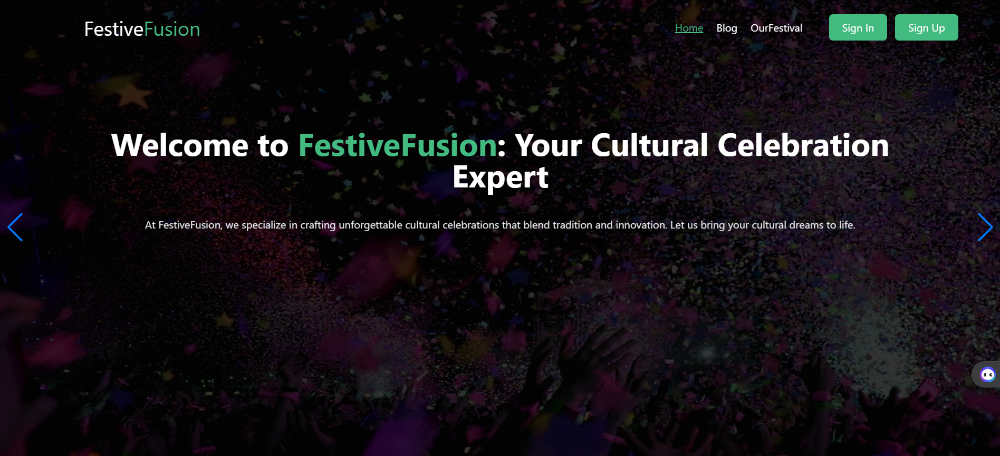

# Festive Fusion || Event Management Platform



Live Link: [Festive Fusion Live](https://event-management-5ac6f.web.app/)


## Project Overview

Festive Fusion is an immersive Event Management Platform, crafted with creativity and precision. This front-end project was developed within a brief timeframe of 3 days, aiming to provide users with a seamless experience in exploring and engaging with event services.

### Features

#### Service Overview:
- *Event Showcase:* Experience a glimpse of our event management services right on the homepage.

#### Restricted Event Details:
- *Exclusive Access:* Detailed event information and pricing are accessible behind user login, ensuring a personalized experience.

#### Interactive Content Hub:
- *Visual Gallery:* Explore our portfolio through an interactive gallery.
- *Client Testimonials:* Gain insights and build trust through displayed client testimonials on the homepage.
- *OurFestival Section:* Engage with events through the "OurFestival" section. Stay updated on upcoming events, book tickets, and participate. (Access requires user authentication)
- *Cultural Blog Feature:* Contribute and read insightful blogs related to cultural celebrations and festivals.

### Usage Technology

#### Front-End:
- *React.js:* Building dynamic and responsive user interfaces.
- *React-Router:* Enabling seamless navigation and user flow.
- *DaisyUi & Tailwind:* Crafting visually appealing and highly customizable designs.
- *AOS & React-Slick:* Enhancing user interactions with animations and slick carousel features.
- *Hot-toast:* Providing a toast notification system for a better user experience.
- *Sweet-alert:* Ensuring a visually appealing and user-friendly alert system.

#### Authentication:
- *Firebase:* Integrating Firebase for secure user authentication.

### Installation

1. Clone the client repository:
   ```bash
   git clone https://github.com/rayhan360/Event-Organization.git
   Install client dependencies:
    cd festive-fusion-client
    npm install